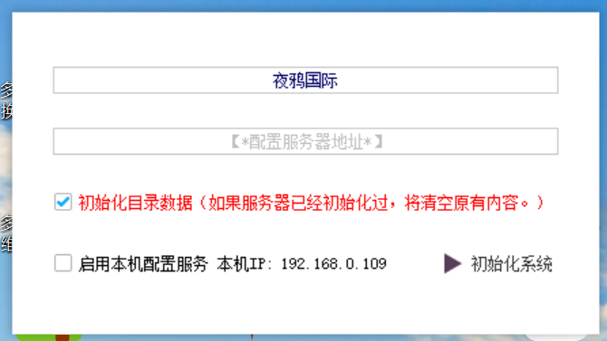
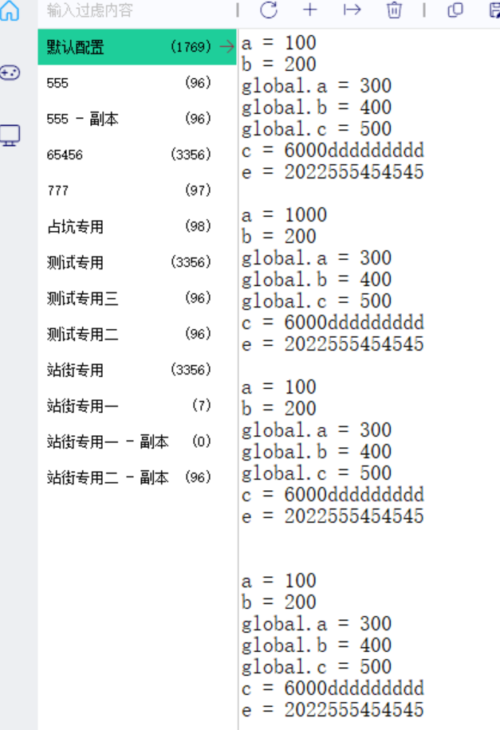
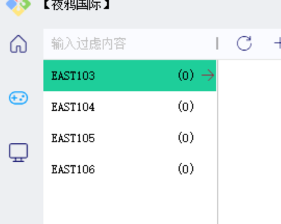

## 1 工具介绍

​	该工具主要作用为提供脚本运行中所涉及到的配置项。

​	在使用时，可用一台主机IP作为终端，再通过利用该工具来进行对需要使用到的数据进行配置。

​	在初次安装该工具进行使用时需要利用激活码进行激活，激活后出现以下画面：

​	按照界面提示信息，输入需要连接的配置服务器地址，勾选需要执行的选项，点击初始化系统。可以看到该服务器下的各种配置项信息。
​	其中主要包括分组、服务、主机

### 1.1 分组列表

​	在控制器打开链接到该服务器时，会使用默认配置，所以默认配置中记录着针对该脚本的最基本的原始的配置，使用人员可以在该列表中生成其他配置（在外部生成相应的ini文件填入配置信息后拖拽到该列表页面），使用需要的配置在控制台中进行选择即可。

### 1.2 服务列表

​	服务列表主要是对于不一样的区可以进行不一样的配置，而其中的配置也只是针对该服务区中运行的脚本

### 1.3 主机列表

### 1.4 注意事项

---

## 2 使用说明

---

