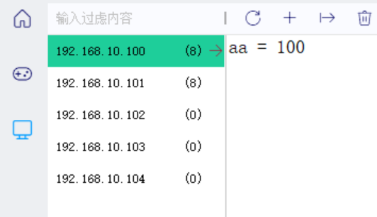
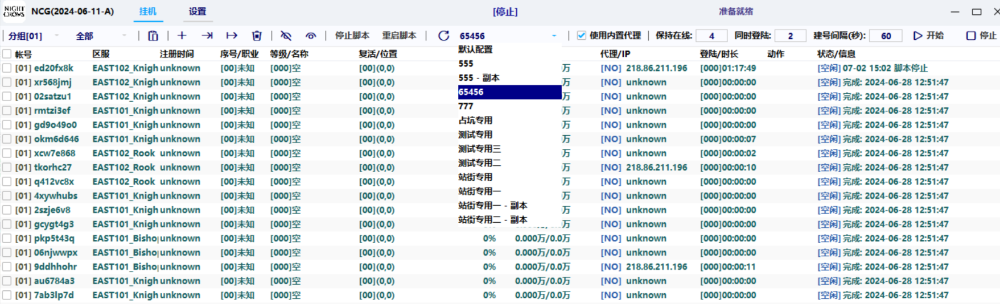

## 1 工具介绍

该工具主要作用为提供脚本运行中所涉及到的配置项。

在使用时，可用一台主机IP作为终端，再通过利用该工具来进行对需要使用到的数据进行配置。

在初次使用该工具进行使用时需要利用激活码进行激活，激活后出现以下画面：


按照界面提示信息，输入需要连接的配置服务器地址，勾选需要执行的选项，点击初始化系统。可以看到该服务器下的各种配置项信息。
	其中主要包括**分组**、**服务**、**主机**


### 1.1 分组列表


在控制台打开连接到该服务器时，会使用默认配置，所以默认配置中可以记录着针对该脚本的最基本的原始的配置，使用者首次使用该配置管理器时并不会像上图中一样有那么多配置，如需额外配置要自己进行手动添加。

**在该列表中生成其他配置的方法：在外部生成相应的ini文件填入配置信息后拖拽到该列表页面就会自动进行添加，使用需要的配置在控制台中进行选择即可。**


### 1.2 服务列表


服务列表主要是对于不一样的区服可以进行不一样的配置，而其中的配置也只是针对该区服中运行的脚本。


### 1.3 主机列表



主机列表主要是对于不一样的主机可以进行不一样的配置，换而言之就是一台机器可以有一套配置


### 1.4 优先级

在控制台上可以选择的只有分组列表中的各种配置，而针对不一样的区服或者不一样的主机可以在服务列表和主机列表进行相关配置项设置后调用。在对服务和主机列表中进行配置数据修改或者增添时，如果配置项的键和选择的分组列表配置中的键相同的话，后者就会对前者进行覆盖（针对相同的区块键对应的配置项的值 ，服务列表中的数据可以覆盖分组列表中的，而主机列表中的可以覆盖服务列表中的）：主机列表>服务列表>分组列表。

举例：

```ini
# 服务列表 - 默认配置中
主线终止等级 = 20

# 服务列表 - （对应的区服中）
主线终止等级 = 22

# 主机列表 - （该机器的IP）
主线终止等级 = 30

# 那么最终主线的终止等级为30，而倘若主机列表中不进行配置，那么就使用服务列表中该区服对应的配置等级，也就是22级，若服务列表中该区服也没有配置，那么最终会使用服务列表中的配置20级
```


---


## 2 使用说明

**前提准备：**

- ConfigManager 压缩包

- 配置模版.ini

  

### 2.1 总控

1. 总控机上面找到一个合适的位置，放置压缩包进行解压打开

2. 进入Data文件夹中编辑config.ini，填写相关配置

   ```ini
   global.active_code = 输入激活码
   global.config_server = 本机ip
   global.project_name = ROM
   ```

3. 双击管理器打开，进行激活进入

4. 分组列表下应该会出现一个空的默认配置

5. 将得到的配置模版.ini复制后放入ConfigManager\Data\group下

6. 打开配置管理器点击上方加号（导入配置），导入配置模版.ini,，成功之后看到分组列表中多出来了配置模版。**首次启动可以将配置模版中的配置信息全部复制到默认配置中。**

   ```ini
   # 关于复制粘贴
   # 对于在管理器中的配置复制，用ctrl c/v 没有作用，在顶上图标中有一个[复制当前配置内容]，鼠标放上去悬浮可以看到信息，该图标点击后可以将当前页面所有配置信息全部复制下来，在其他配置中可以直接全部粘贴，但是是全部的配置信息，不利于复制指定配置，建议可以在ini文件打开后进行粘贴复制或者在管理器中利用首页配置
   ```

7. 若在配置管理器中添加某个配置信息后，请将下列图标依次点击一次

   


### 2.2 其他机器

1. 其他机器不用像总控一样下载安装配制管理器

2. 双击打开控制台

3. 登录界面输入卡号和对应的配置服务器IP（也就是总控的ip 表示该台机器是该IP机器的控制下）进行登录

   

   如图所示，可以选择连接到的服务器中的设置好的配置

4. 至此该机器下的脚本运行起来使用的配置就是对应总控的配置（优先级见上）


---


